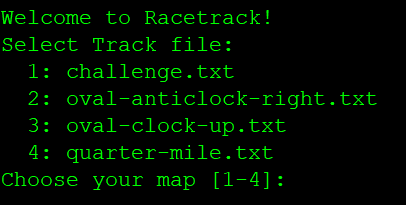
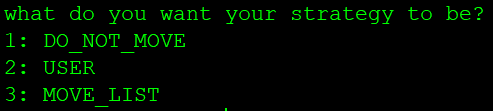
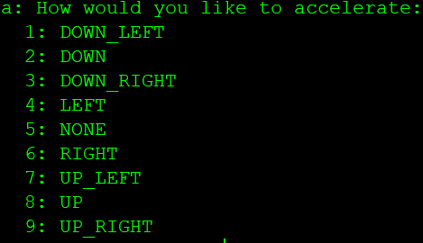
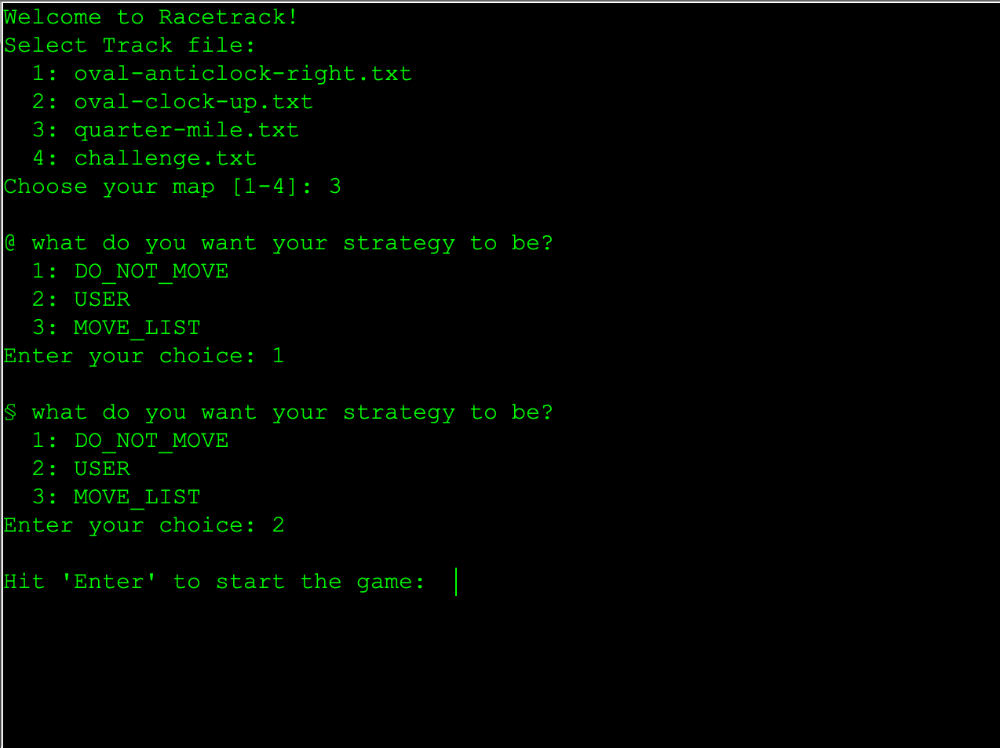
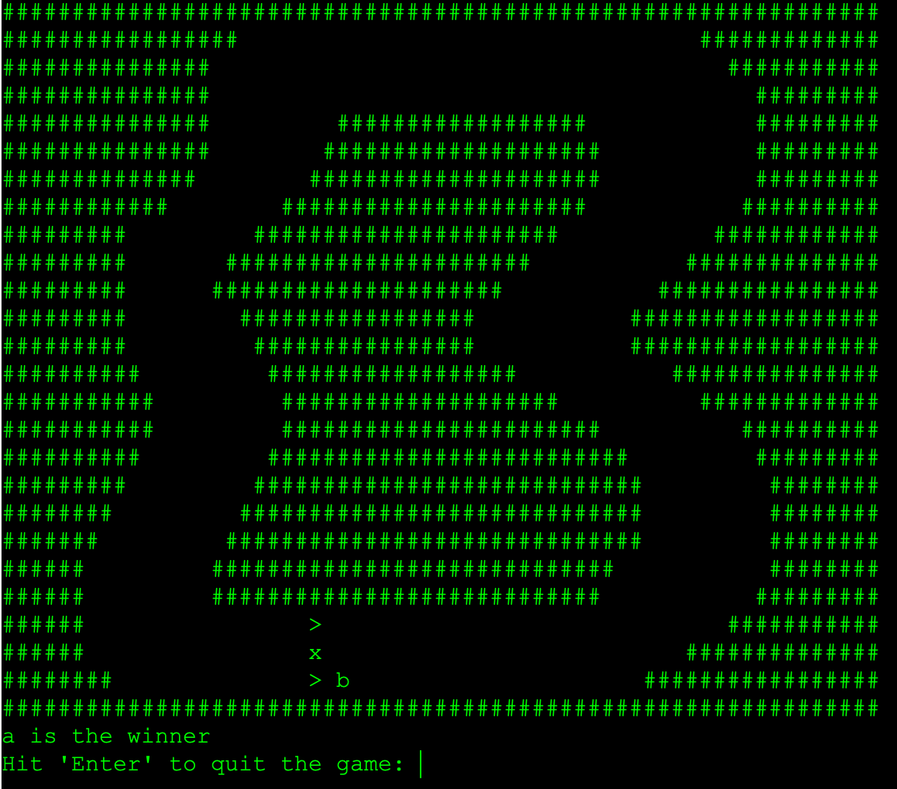

# gruppe02-caffeineaddicts-projekt1-racetrack

# Racetrack

Gotta go fast!

# Getting Started

This project was written in Intellij and tested in TextIO.

# Team

* **Nikita Smailov** - Head of Development aka Assistant Caffeine Addict

* **Oliver Corrodi** - Director of Testing classes and tracks aka Chief Caffeine and Nicotine Addict

* **Erman Zankov** - First Executive Programmer specialized in car mechanics aka Longboi

* **Tobias Ritscher** - Senior Software Engineer in the Interface Departement aka Diseased Penguin

# License

This project is licensed under the ZHAW License - see [ZHAW](http://www.zhaw.ch) for details

# Manual
## First Steps ##
At the start of the game a map needs to be selected in order to play.

Then each player decides for their car's strategy.
There are three possible strategies to pick from.

## Main Game ##
After the setup part of the game you are left with the actual game.
Rules are simple: First to cross the finish line wins.
Be careful! Running into a wall or crashing in another car means game over for You!
To control your car are 9 controls at your disposal.
Choose wisely since the speed adds up.

# Screenshot

# Class Diagram

